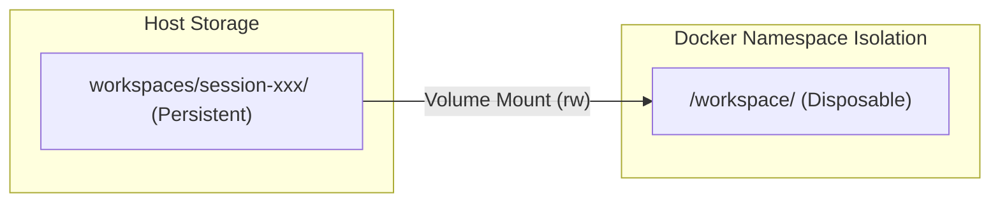

# Cloud-Native Architecture Diagrams

## Unified System Architecture

```mermaid
graph TD
    subgraph Client
        Browser[React UI / Iframe Preview]
    end

    subgraph Orchestrator (Control Plane)
        FastAPI[FastAPI Gateway]
        DockerSDK[Docker Python SDK]
        Registry[Session Registry]
    end

    subgraph Compute (Isolated Sandbox)
        Container[Docker Container: agent-runtime]
        CodexCLI[Codex CLI Executable]
    end

    subgraph Storage (Data Plane)
        Volume[Host Disk: workspaces/session-xxx]
    end

    Browser -- REST Request / WS Upgrade --> FastAPI
    FastAPI -- Registry Lookup --> Registry
    FastAPI -- Spawn / Exec Run --> DockerSDK
    DockerSDK -- Control Lifecycle --> Container
    Container -- Read/Write --> Volume
    Container -- Stream stdout --> FastAPI
    FastAPI -- JSONL WS Frames --> Browser
```

## Storage Mounting Layout


